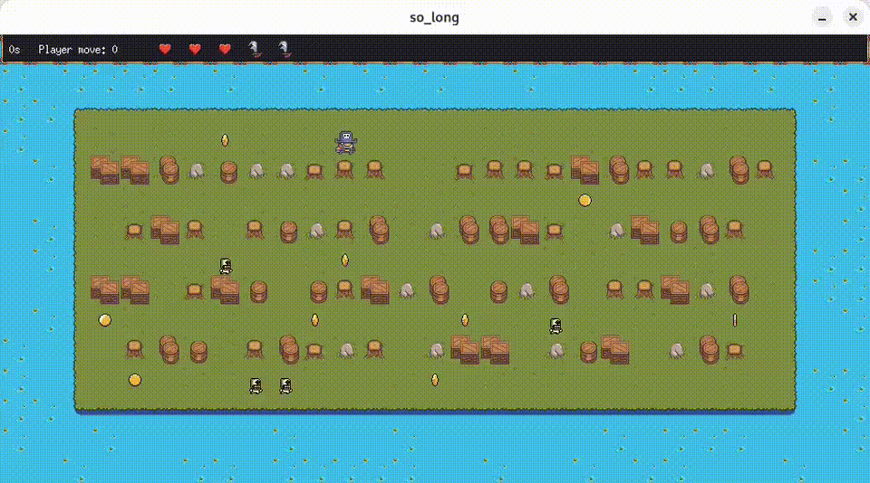
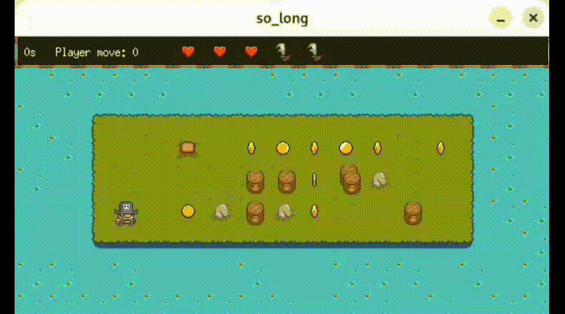

# so_long

`so_long` is a top-down 2D game built with MiniLibX on Linux/X11.
This version goes beyond the classic collectible hunt: it uses **A*** pathfinding for map validation and for enemy movement, so the same logic can be reused by the gameplay systems.

You play as a character moving through a tile-based map, collecting rotating coins while avoiding enemies that actively chase you.
Once every collectible is picked up, the exit becomes available, and you can finish the level.

## Previews







## Features

- Map parsing and validation
- Rectangular closed maps with a full playable path
- **A*** pathfinding used for:
  - validating that all collectibles and the exit are reachable
  - enemy movement toward the player
- Animated collectibles represented as rotating coins
- Enemy AI that follows the player
- Player health system with **3 HP**
- Directional projectile attack using the arrow keys
- HUD showing useful in-game information

## Controls

- `W` `A` `S` `D` — move the player
- Arrow keys — throw a weapon in the chosen direction
- `Esc` — quit the game
- Window close button — quit the game

## Gameplay

- The player starts with **3 HP**.
- Collectibles are coins and are removed when you step on them.
- Enemies try to reach the player using A* pathfinding.
- If an enemy gets next to the player, the player loses **1 HP**.
- When all collectibles are collected, the exit appears / becomes usable.
- The game is won by reaching the exit after collecting everything.
- The game is lost when the player reaches **0 HP**.

## Map format

Maps are stored as `.ber` files inside the `maps/` directory.

Supported characters:

- `1` — wall
- `0` — empty tile
- `P` — player start position
- `E` — exit
- `C` — collectible coin
- `2` — enemy spawn

Rules enforced by the parser:

- the map must be rectangular
- the borders must be closed by walls
- the map must contain exactly one player start and one exit
- the map must contain at least one collectible
- every collectible and the exit must be reachable

Sample maps are provided in `maps/`, for example:

- `maps/simple.ber`
- `maps/medium.ber`
- `maps/big.ber`
- `maps/enemies.ber`
- `maps/fail.ber`
- `maps/fail2.ber`
- `maps/debbug.ber`

## Build

The project includes its own `libft` and MiniLibX sources.

```bash
make
```

This builds the executable `so_long`.

## Run

```bash
./so_long maps/simple.ber
```

You can replace `maps/simple.ber` with any valid `.ber` map.

## Clean

```bash
make clean
make fclean
make re
```

## Notes

- I built this project some time ago. While it works, the implementation would need refactoring to be cleaner and more maintainable.

